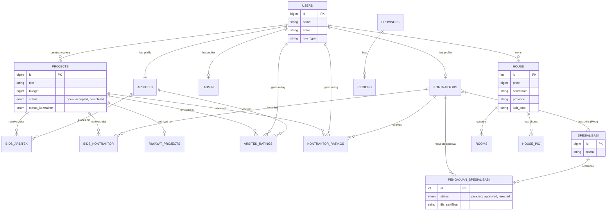

#  4C - Construction Bidding System (Backend API)

##  About The Project

**4C (Construction, Cost, Consultation, Contractor)** is a comprehensive **web-based marketplace platform** built with **Laravel**. The system is designed to bridge the gap between property owners and trusted construction professionals (Architects & Contractors).

Unlike traditional manual tenders, 4C digitizes the entire process through a transparent **online bidding mechanism**, allowing users to post projects, receive offers, and manage construction progress directly via a responsive web dashboard.

###  Key Objectives
* **Transparency:** Providing a fair bidding environment for construction projects.
* **Connectivity:** Bridging the gap between homeowners and certified professionals.
* **Efficiency:** Digitizing the traditional tender/bidding process for small-to-medium scale projects.

---

## Web Core Features

Designed as a large-scale monolithic web platform, 4C integrates multiple complex modules beyond standard CRUD:

* **Advanced Multi-Role Ecosystem (RBAC):**
    * `User/Owner`: Can post construction projects, select professionals, and buy/sell properties.
    * `Arsitek`: Specialized dashboard to bid on design projects & manage architectural portfolios.
    * `Kontraktor`: Dedicated panel to bid on construction tenders, verify certifications, and report progress.
    * `Admin`: Centralized control panel for user verification, content moderation, and system configuration.

* **Construction Bidding Engine:**
    * A sophisticated auction system where User projects are open for competitive bidding from Architects and Contractors.
    * Includes validation logic to prevent price manipulation and ensure fair competition.

* **Property Marketplace with GIS (Maps):**
    * **House Trading:** Users can list houses for sale with detailed specifications (dimensions, rooms).
    * **Interactive Map Integration:** Property locations are visualized on a map, allowing users to search houses based on specific regions/coordinates.

* **Project Lifecycle Management:**
    * Automated workflow engine tracking projects from `Open Tender` -> `Bidding Process` -> `Development` -> `Completed`.
    * Includes status reporting for Contractors to update project progress directly on the dashboard.

* **Professional Verification System:**
    * Admin-controlled verification flow for professional certifications (SIUP/Expertise) to maintain platform credibility. Allows professionals to showcase their specialization and past work.

---
## Database Schema (Auto-Generated)

---

## The Author

This project is a collaborative Final Project developed by:

| Name | Role | Contact |
| :--- | :--- | :--- |
| **Davin Akmal Yasha** | Fullstack Developer (Backend Lead & Web/Android) | [davinyasa06@gmail.com](mailto:davinyasa06@gmail.com) |
| **Muhammad Daffa Ramadhan** | Frontend Developer | [amateurmdr@gmail.com](mailto:amateurmdr@gmail.com) |
| **Athallah Khansa Ziven** | QA & Frontend Developer | [ziven23junior@gmail.com](mailto:ziven23junior@gmail.com) |

> *"Building solutions that bridge the gap between needs and expertise."*

---

## API Endpoints Documentation

Berikut adalah daftar endpoint utama yang digunakan untuk komunikasi antara Aplikasi Android dan Backend Laravel.

### Authentication & Users
| Method | Endpoint | Description |
| :--- | :--- | :--- |
| `POST` | `/login` | User login (Session/Token) |
| `POST` | `/register` | Register new user |
| `GET` | `/profile/{tab}` | Get user profile details |
| `PATCH` | `/profile/{id}` | Update user profile data |
| `POST` | `/profile/add_phone_number` | Add phone number to profile |

### Project Forum (4C Core)
| Method | Endpoint | Description |
| :--- | :--- | :--- |
| `GET` | `/forum-project` | Get list of all available projects |
| `GET` | `/forum-project/{id}` | Get detail of a specific project |
| `POST` | `/form-post-project` | Create/Post a new project (Owner) |
| `PUT` | `/project/{id}/mark-completed` | Mark a project as completed |

### Bidding System
| Method | Endpoint | Description |
| :--- | :--- | :--- |
| `POST` | `/arsitek/bid/{project}` | Submit a bid (Role: Arsitek) |
| `POST` | `/kontraktor/bid/{project}` | Submit a bid (Role: Kontraktor) |
| `POST` | `/arsitek/bid/{project}/{arsitek}/select` | Select winning Arsitek (Role: User) |
| `POST` | `/project/{project}/select-kontraktor/{kontraktor}` | Select winning Kontraktor (Role: User) |
| `GET` | `/project/{id}/bids` | View list of bids for a project |

### House & Location Data
| Method | Endpoint | Description |
| :--- | :--- | :--- |
| `GET` | `/houses_list` | Get list of houses |
| `POST` | `/create_house` | Register a new house data |
| `GET` | `/dashboard/getRegion/{provinceId}` | Get regions based on province (Dropdown) |
| `GET` | `/search-province` | Search province data |
| `GET` | `/search-city` | Search city data |
